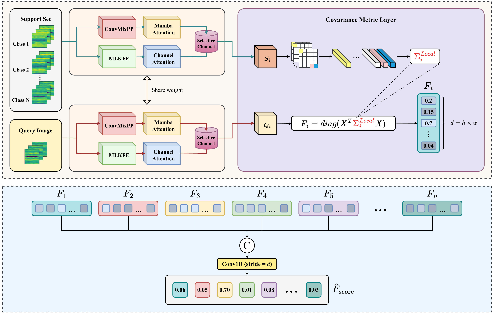

# 🔧 SC-MambaFew: Few-shot Learning for Bearing Fault Diagnosis

<div align="center">

[](https://doi.org/10.1016/j.compeleceng.2024.110004)
[](https://www.python.org/)
[](LICENSE)
[](https://github.com/giabao804/few-shot-mamba)

*Few-shot learning based on Mamba and selective spatial-channel attention for bearing fault diagnosis*

</div>

## 🎯 Overview

This repository contains the official implementation of **SC-MambaFew**, a novel few-shot learning approach that combines Mamba architecture with selective spatial-channel attention mechanisms for bearing fault diagnosis. Our method achieves state-of-the-art performance with minimal training data.

## 🏗️ Methodology

<div align="center">
  
  <p><em>Figure 1: SC-MambaFew model architecture</em></p>
</div>

## 🌍 Environment Setup

### 📋 Prerequisites
- Python 3.10.12
- CUDA-compatible GPU (recommended)
- Anaconda/Miniconda

### 🔧 Installation

1. **Create and activate conda environment:**
```bash
conda create -n MAMBA python=3.10.12 -y
conda activate MAMBA
```

2. **Install dependencies:**
```bash
pip install --upgrade pip
pip install -r requirements.txt
```

## 📊 Dataset

We evaluate our model on two benchmark datasets:

| Dataset | Description | Download Link |
|---------|-------------|---------------|
| 🏭 **CWRU** | Case Western Reserve University Bearing Data | [Download](https://engineering.case.edu/bearingdatacenter) |
| 🎓 **HUST** | Hanoi University of Science and Technology | Coming Soon |

## 🚀 Getting Started

### 1️⃣ Clone Repository
```bash
git clone https://github.com/giabao804/few-shot-mamba.git
cd few-shot-mamba
```

### 2️⃣ Prepare Data
Download and extract the CWRU dataset:
```bash
gdown 1VZ5GbFPZV1lfkkyHpGtIiTuql4vYoyX3
unzip CWRU.zip
```

### 3️⃣ Training

Make training script executable:
```bash
chmod +x train.sh
```

**1-shot training:**
```bash
bash train.sh 1
```

**5-shot training:**
```bash
bash train.sh 5
```

### 4️⃣ Testing

Make testing script executable:
```bash
chmod +x test.sh
```

**1-shot evaluation:**
```bash
bash test.sh 1
```

**5-shot evaluation:**
```bash
bash test.sh 5
```

## 📞 Contact

We welcome questions, suggestions, and collaborations!

- 📧 **Primary Contact**: [bao.tg212698@sis.hust.edu.vn](mailto:bao.tg212698@sis.hust.edu.vn)
- 📧 **Alternative**: [giabaotruong.work@gmail.com](mailto:giabaotruong.work@gmail.com)
- 🐛 **Issues**: Please report bugs via [GitHub Issues](https://github.com/giabao804/few-shot-mamba/issues)

## 📚 Citation

If you find this work helpful, please give us a ⭐ and cite our paper:

```bibtex
@article{truong2025sc,
  title={SC-MambaFew: Few-shot learning based on Mamba and selective spatial-channel attention for bearing fault diagnosis},
  author={Truong, Gia-Bao and Tran, Thi-Thao and Than, Nhu-Linh and Nguyen, Thi Hue and Pham, Van-Truong and others},
  journal={Computers and Electrical Engineering},
  volume={123},
  pages={110004},
  year={2025},
  publisher={Elsevier}
}
```

---
<!-- 
<div align="center">
  <p>Made with ❤️ by the SC-MambaFew Team</p>
  <p>
    <a href="#-sc-mambafew-few-shot-learning-for-bearing-fault-diagnosis">Back to Top ⬆️</a>
  </p>
</div> -->